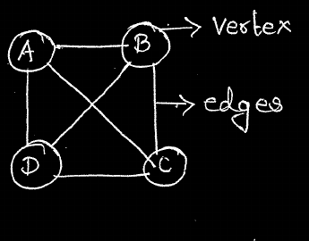
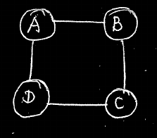
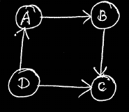
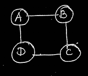
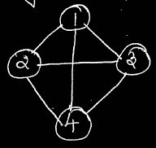
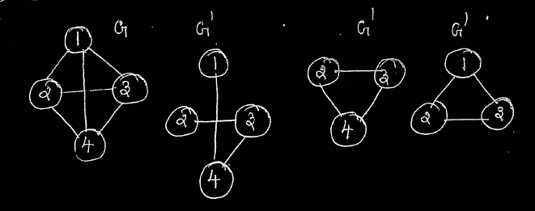
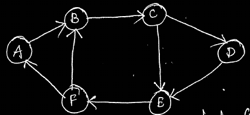
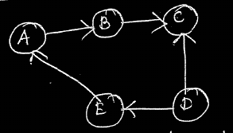
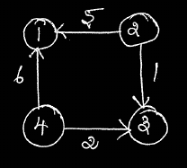
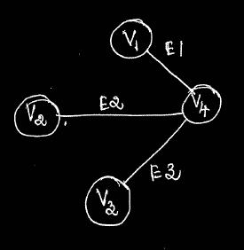

# <u>Graphs</u>

## Table of Contents
- [Introduction](#Graphs)
- [Types of Graphs](#types-of-graphs)
    - [Undirected Graph](#undirected-graph)
    - [Directed Graph](#directed-graph-or-digraph)
- [Restriction on a Graph](#restriction-on-a-graph)
- [Graph Terminologies](#terminologies-in-graph)
    - [Path](#path)
    - [Cycle](#cycle)
    - [Complete Graph](#complete-graph)
    - [Subgraph](#subgraph)
    - [Connected Graph](#connected-graph)
        - [Unirected](#undirected)
        - [Directed](#directed)
    - [Degree of a Graph](#degree-of-a-graph)
        - [Undirected Graph Degree](#undirected-graph-degree)
        - [Directed Graph Degree](#directed-graph-degree)
    - [Source Vertex](#source-vertex)
    - [Sink Vertex](#sink-vertex)
    - [Isolated Vertec](#isolated-vertex)
    - [Weighted Graph](#weighted-graph)
    - [Pendant Vertex](#pendant-vertex)
- [Representation of a Graph](#representation-of-a-graph)
    - [Incidence Matrix](#incidence-matrix)

## Introduction

A graph is a non-linear data structure that consists of a set of non-empty **Vertices** with a set of **Edges**.Each edge joins two different Vertices.

    

### Types Of Graphs
 1. Undirected Graph
 2. Directed Graph

## Undirected Graph

If an edge between any two nodes is *not directly oriented*, then it is undirected graph

    

**(A,B) & (B,A) represents the same edge** 

## Directed Graph (or) *Digraph*

If an edge between any two nodes is *directly oriented, then it is directed graph

    

**(A,B) Shows the edge between A and B**

Here A is called the *Tail node* and B is called the *Head node*

### Restriction On a Graph

- A graph may not have an edge from a vertex V back to itself. If it has an eged to itself, then it is called **Self edges**.
- A graph may not have multiple occurrence of the same edges *(multigraph)*

## Terminologies in Graph

### Path 

A path is a sequence of distinct Vertices each adjacent ot the next.

    

*Path from A to C is (A,B),(B,C)*

### Cycle

A cycle is a simple path in which first and last vertices are same.

    

*ABCD is cyclic as it starts and ends with the same vertex*

In a digraph. a cycle is referred as *Directed Cycle*.

**Note : The maximum number of edges in a graph with *n* vertices is *n(n+1)/2***

### Complete Graph

An n-vertex, undirected graph with *exactly n(n+1)/2 edges* is said to be a complete graph.

    

*n=4, no of edges = 4(4+1)/2 = 6*

### Subgraph

A subgraph of G is a graph G' such that *V(G') is a subset of V(G)

    

*Subgraphs of G*

### Connected Graph 
#### Undirected

If there exists a path from any vertex to any other vertex, then that graph is called **connected graph**.
#### Directed

If for every pair of distinct vertices there is a directed path from every vertex to every other vertices, then that graph is called **Strongly connected graph**.

    

*Strongly Connected Graph*

If any vertex dosen't have a directed path to any other vertices, then the graph is called **Weakly connected Graph**.

    

*Weakly Connected graph*

### Degree of a graph

#### Undirected Graph Degree

Undirected graph only have one degree, ie. the The number of edges connected directly to a node

    

*The degree of A is 2*

#### Directed Graph Degree

Directed Graphs have two types of degrees, namely

- **Indegree** - The number of edges entering the node. 
- **Outdegree** - The number of edges leaving the node.

 

    

| Node | Indegree | Outdegree |
|------|----------|-----------|
| A    | 1        | 1         |
| B    | 1        | 1         |

### Source Vertex
A vertex whose *indegree is zero* is referred as source vertex.

### Sink Vertex
A vertex whose *outdegree is zero* is referred as sink vertex.

### Isolated Vertex
If a graph has onlu one vertex in it, it is a isolated graph vertex.

### Weighted Graph
If every edge in the graph is assigned some weight (or) value, then the graph is called *Weighted Graph*

    

*Weighted Graph*

### Pendant Vertex
A vertex whose indegree is 1 and outdegree is 0 is referred to as *Pendant Vertex*.

## Representation of a Graph

### Incidence Matrix
A graph containing m vertices and n edges can be represented by a matrix with m rows and n columns. The matrix is formed by storing 1 in the ith row and jth column corresponding to the matrix, if there exists a ith vertex connected to one end of the jth edge and a 0 if there is no ith vertex connected to any end of the jth edge of the graph, such a matrix is referred to as *incidence matrix*.

 

<i>Consider the given weighted graph</i>

    

    incidence_matrix[i][j] = 1, if there is an edge
                             0, otherwise

The Incidence Matrix for this graph is given by:

|               | E1 | E2 | E3 |
|---------------|---------------|---------------|---------------|
| V1 | 1             | 0             | 0             |
| V2 | 0             | 1             | 0             |
| V3 | 0             | 0             | 1             |
| V4 | 1             | 1             | 1             |
